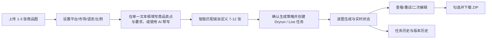
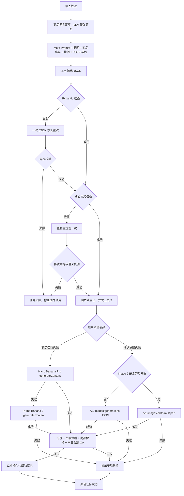

# Listingo 业务逻辑规格书

> 本文档是开发与验收的唯一业务真实依据。实现、测试和界面文案如与其他说明冲突，以本文档为准。

## 1. 产品范围

Listingo 提供四期统一入口：商品套图、A+详情、视频与爆款复刻、Agent与画布。当前一期具备真实模型链路；二至四期只执行本地模拟任务，必须展示“功能演示”，且绝不触发外部模型。

平台默认全局 Dryrun。所有 Provider 预置但关闭，不包含 API Key。用户在本机后台手工配置、测试并启用后，才能创建 Live 任务。

## 2. 一期用户旅程



### 输入规则

- 单任务必须上传 1–3 张 JPG、PNG 或 WebP；每张最大 15MB。
- `count` 必须为 7–12。
- 比例按前台 DesignKit 风格选项收敛为 `1:1`、`3:4`、`9:16`、`16:9`。
- 自定义结构固定为白底图、场景图、卖点图、其他四类；每类 0–4 张，总数必须为 7–12 张且与 `count` 一致。智能匹配固定生成 7 张，由 Meta Prompt 规划具体类型。
- 前台只提供一个“商品卖点与要求”文本框，以浅色占位内容提示填写商品名称、核心卖点、适用人群、期望场景和具体参数，不逐项暴露结构化字段；空内容不能创建生成任务。
- “AI 帮写”使用后台可版本化的 `copywriting-assist` 完整提示词，实际传入用户提供的 Role / Workflow / Constraints / Output Format / Output Reference 全文；该 Prompt 只控制卖点与场景候选回填节点，不替代核心 Meta Prompt、生图 Prompt 或二次编辑 Prompt。输出为“商品定位 / 适用场景 / 5大核心卖点”三段 Markdown 文本；先展示可编辑候选内容，允许重新生成，只有用户确认后才回填原文本框。禁止虚构价格、销量、认证、规格、功效与竞品结论。Dryrun 使用同结构确定性本地文案，Live 使用默认 LLM 并在失败时回退备用 LLM；此节点不强制 `response_format=json_object`。
- 后端结构化商品字段仍包括商品名称、品类、规格、SKU、配件、认证、目标人群和品牌风格，由单文本输入与商品图视觉事实共同解析；不可见或未提供内容必须标记不确定，不得编造。
- Live 模式必须存在已启用的默认 LLM，以及当前用户偏好对应的图片 Provider 和可用密钥；否则创建前失败。

## 3. 提示词与执行链路

核心 Meta Prompt 的唯一内容源是用户上传的 `电商Meta图片提示词_完整修订版.md`。该文件按字节意义保存为首个版本，不回写原文。Live 运行时在原文前加入本次任务变量块，并在原文后追加 JSON 输出契约；变量块明确高于原文示例中的同名变量。禁止从 Artflo 或其他系统导入、拼接、覆盖任何提示词内容；Artflo 仅可作为后台 Workflow 画布的视觉交互参考。



标准合约：

```json
{
  "schema_version": "1.0",
  "images": [
    {
      "route_symbol": "#@",
      "image_type": "主图",
      "picture_requirement": "画面要求",
      "copywriting_requirements": "文案要求"
    }
  ]
}
```

- 一期只接受 `#@`；未知符号在图片模型调用前失败。
- 缺字段、非法比例、数量不符同样在模型调用前失败。
- JSON 解析/校验失败只修复一次。
- 核心语义校验至少检查：每张图显式比例、商品锁定、无文字策略、Amazon 首图白底、自定义数量和重复图片职责；不合格只允许整套重规划一次。
- 规划 LLM 同时接收结构化 `product_facts` 与原始商品图，不再只依赖用户卖点文本。
- 自定义结构会形成 `白底图X张、场景图Y张、卖点图Z张、其他图W张` 的高优先级运行时数量指令，进入用户上传的核心 Meta Prompt；该 Prompt 按自身规则把四类继续映射到图片类型与 `#@` JSON 项，不存在四套额外 Prompt。
- 商品保持优先时单项按 Nano Banana Pro → Nano Banana 2 回退一次，不跨能力回退至 Image 2；视觉排版优先时直接选择 Image 2。Image 2 无参考图时走 `/images/generations`；带商品参考图时走 `/images/edits`，不得把 `image` JSON 字段错误发送到 generations。
- 结果一旦成功立即落盘，不因其他项失败而丢弃。
- 图片只有在文件可解码、比例方向合理且后台 `image-quality-review` 提示词返回通过后才标记成功；未通过项记录到 `image_qa` 节点并可单独重试。
- 聚合状态只允许 `succeeded`、`partial_failed`、`failed`。

## 4. Dryrun

- Dryrun 不执行任何外部 HTTP 模型请求。
- 使用固定的确定性 JSON 计划模拟 Meta Prompt 输出；Dryrun 不执行、也不验证核心 Prompt 的语义效果。
- Dryrun 会确定性模拟商品视觉事实、语义审查和图片 QA 节点，验证完整状态机，但不证明真实模型的视觉理解或审查质量。
- 使用本地演示资产走完创建、排队、生成、聚合、日志、历史、版本与 ZIP 状态机。
- Dryrun 日志与 Live 使用同一结构，并明确标记 `dry_run=true`。

## 5. 二次编辑与版本

- 输入由当前版本图、原始商品图、修改要求构成。
- Live 时使用任务锁定的 `edit-rewrite` 提示词和 LLM 转写修改要求，再按原任务的模型偏好调用图片 Provider。Nano Banana Pro/Nano Banana 2 使用支持参考图的 `generateContent`；Image 2 使用 `/images/edits` multipart。
- 二次编辑结果同样执行比例和 `image-quality-review` 审查，通过后才能创建子版本。
- 新结果创建 `generation_version` 子版本，保存 `parent_version_id`，不覆盖原图。
- Dryrun 生成确定性的本地子版本，用于完整演示版本链路。

## 6. Provider 规则

- LLM 默认/备用：GPT‑5.4‑Mini / Qwen‑3.6。
- 商品保持优先：Nano Banana Pro（`gemini-3-pro-image`）为默认，失败回退 Nano Banana 2（`gemini-3.1-flash-image`）。
- 视觉排版优先：直接使用 Image 2（`gpt-image-2`），不向前台暴露模型名。
- Nano 2 固定为 `gemini-3.1-flash-image` 与 `/v1beta/models/gemini-3.1-flash-image:generateContent`；没有 OpenAI Images 的 `size` 字段，`resolution` 映射到 `generationConfig.responseFormat.image.imageSize` 档位 512/1K/2K/4K，画面比例映射到同一对象下的 `aspectRatio`。
- Image 2 的 `size` 是像素尺寸或“跟随任务比例”策略，与 Nano 的分辨率档位不是同一字段。
- 默认、备用关系按能力类型分别唯一。
- 密钥加密保存；读取接口只返回掩码和 `has_api_key`。
- 连通测试必须由运营人员显式点击，不因保存配置自动发起。
- 请求/响应日志排除 API Key、Authorization、Cookie 和完整 base64。
- Provider 只有同时满足“启用开关打开”和“API Key 已配置”才具备调用条件；Dryrun 即使 Provider 已生效也不会外调。后台模型页按“提示词理解与任务规划 / 商品保持优先 / 视觉排版优先”分组，并显示单模型状态和整条业务链路是否完整生效。

## 7. Workflow 与版本

- Workflow 由节点、边、视口和节点配置组成；版本不可变。
- 启用前必须验证：单一输入、商品视觉事实、Meta Prompt、LLM、结构校验、语义审查、图片生成、图片 QA、聚合节点齐备，且只能沿允许方向连线。
- 已创建任务始终引用其创建时的 Workflow 与 Prompt 版本，不随后台启用版本变化。
- 后台 Dryrun 仅验证节点顺序与确定性输出，不调用模型。
- 当前版本的 Workflow 画布是版本、连线校验和任务引用控制面；运行时节点顺序仍由后端固定执行器实现，修改画布布局或节点属性不会动态改写执行代码。
- Prompt 后台不是纯展示：启用版本会被后续 Live 任务锁定并传入 LLM；历史任务继续引用创建时版本。Dryrun 只记录版本与长度，不使用 Prompt 语义生成图片计划。
- 提示词资产允许上传 UTF-8 的 MD/TXT 文件（最大 2MB）创建不可变新版本；上传后不自动启用，运营人员必须在版本历史中明确选择生效版本。
- Prompt 工程固定包含 `ecommerce-meta`、`product-vision`、`copywriting-assist`、`edit-rewrite`、`image-quality-review` 五类资产；后四类不修改用户上传的核心 Meta Prompt，分别控制对应系统节点。

## 8. 状态与异常

| 场景 | 行为 |
|---|---|
| 上传非法 | 422，不创建资产记录 |
| Meta Prompt 结构非法 | 一次修复，仍失败则任务 `failed` |
| 单图默认模型失败 | 回退备用模型一次 |
| 部分图片失败 | 保留成功项，任务 `partial_failed` |
| 全部图片失败 | 任务 `failed` |
| 重试失败项 | 只新执行失败项，不覆盖成功项 |
| ZIP 无有效选择 | 422 |
| Provider 无密钥/未启用 | Live 创建或测试明确失败 |
| 二至四期操作 | 本地模拟，永不调用外部模型 |

## 9. API

公共接口位于 `/api/v1`，运营接口位于 `/api/v1/admin`。完整请求与响应模型由 FastAPI OpenAPI 文档生成。前端每秒轮询任务详情，直至进入终态。

## 10. 非目标

不实现用户、支付、公网安全、Redis、Celery、对象存储或生产数据库。`/admin` 无登录，仅用于绑定 `127.0.0.1` 的本机 Demo。
