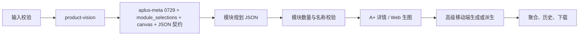
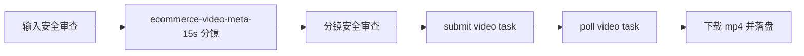

# Listingo 业务逻辑规格书

本文档是开发与验收的业务真实依据。若实现、测试或其他说明冲突，以本文档和当前源码为准。

## 产品范围

Listingo 提供四期统一入口：

- 一期商品套图：支持 Dryrun 和 Live。Live 链路包含商品视觉事实、核心 Meta Prompt 规划、JSON 契约、语义校验、内容安全、并发生图、二次编辑、OCR 改字、失败重试、版本、ZIP/长图下载。
- 二期 A+ 详情页：支持 Dryrun 和 Live。使用 `aplus-meta` 0729 资产规划模块，按 `module_selections` 和 `output_targets` 生成详情页、普通 A+、高级 A+ Web、600:450 移动端图。
- 三期视频与爆款复刻：支持 Dryrun 和 Live。Live 使用 Seedance 2.0 视频 Provider 目录，按 route chain 提交、轮询和下载 mp4。
- 四期 Agent 与画布：当前为交互演示，不具备生产 Agent 执行链路。
- 账号与运营：支持短信/密码登录、管理员二次验证、账号中心、套餐额度、模拟支付订单、通知、运营监控、短信配置、OCR 配置和 Provider/Prompt/Workflow 后台管理。

全局默认 Dryrun。Live 模式必须由本机后台配置 Provider、API Key、Prompt 和必要运行时设置。API Key、短信凭据、运行时 DB、上传和生成结果不属于 Git 源码资产。

## 输入规则

- 商品图上传支持 JPG、PNG、WebP，单文件最大 15MB。
- 套图任务上传 1-6 张商品图；智能匹配固定生成 7 张，自定义结构生成 7-12 张。
- 套图自定义结构包含白底图、场景图、卖点图、其他图四类，每类 0-4 张，总数必须与 `count` 一致。
- A+ 计划任务上传 1-6 张商品图；`module_selections` 是 `{name, count}` 数组，总模块数由 `module_total` 计算。
- A+ `output_targets` 决定输出模式与比例。非亚马逊平台不得创建普通 A+ 或高级 A+ 输出。
- 视频任务上传 1-6 张商品图，支持 1-3 个 `video_types`，默认 15 秒、720p、生成音频。
- 批量任务按 `LISTINGO_MAX_BATCH_TASKS`、`LISTINGO_MAX_BATCH_ITEM_ASSETS`、`LISTINGO_MAX_ACTIVE_BATCH_ITEMS` 和 `LISTINGO_MAX_PROVIDER_CONCURRENCY` 控制上限。
- 用户未提供或图片不可见的商品事实必须标注不确定，不得编造价格、销量、认证、规格、功效或竞品结论。

## 当前运行 Prompt

源码 seed 使用 8 类 Prompt 资产：

| Code | 运行节点 |
|---|---|
| `ecommerce-meta` | 套图核心规划 |
| `aplus-meta` | A+ 详情页模块规划 |
| `product-vision` | 商品视觉事实 |
| `copywriting-assist` | 套图/视频卖点帮写 |
| `edit-rewrite` | 二次编辑指令转写 |
| `image-text-edit` | OCR 改字指令转写 |
| `content-safety-review` | 内容安全 LLM 审查 |
| `ecommerce-video-meta-15s` | 视频分镜规划 |

`image-quality-review` 是历史 Prompt 记录，可能保留在本地 SQLite 中，但当前 Workflow 和执行器不再调用。

## Provider 规则

- 源码 Provider 目录当前包含 47 个预设：3 个 LLM 与 44 个图片/视频中转模型。
- 支持中转站分组：HelloBabyGo、fal.ai、Runware、OpenRouter、Atlas Cloud、Replicate、WaveSpeedAI、Kie.ai、CometAPI、API Models。
- Route slot 固定为 `primary`、`backup1`、`backup2`、`backup3`、`backup4`；旧 `fallback` 输入只作为 `backup1` 兼容别名。
- Live 选择 Provider 时优先使用 route role，而不是只看全局默认/备用。
- Provider 只有同时启用并配置 API Key 才可用于 Live。
- 请求/响应日志必须脱敏，不记录 API Key、Authorization、Cookie 或完整 base64。

默认源码 route chain：

| Route | 默认链路 |
|---|---|
| `llm` | Doubao Seed 2.0 Mini → Qwen-3.6 |
| `suite_fidelity` | API Models Nano Banana Pro → Kie Nano 2 → Atlas Nano 2 → API Models Nano 2 → Runware Nano 2 |
| `suite_layout` | Atlas GPT Image 2 → CometAPI GPT Image 2 → Runware GPT Image 2 → fal.ai GPT Image 2 → OpenRouter GPT Image 2 |
| `aplus_detail` | 与 `suite_layout` 相同 |
| `aplus_mobile` | Atlas GPT Image 2 Edit → CometAPI → Runware → fal.ai → OpenRouter |
| `image_edit` | 与 `aplus_mobile` 相同 |
| `video` | HelloBabyGo Seedance 2.0 → CometAPI → Kie.ai → Atlas → WaveSpeedAI |

## 套图执行链路

- JSON 顶层必须为 `{schema_version:"1.0", images:[...]}`，每张图必须包含 `route_symbol`、`image_type`、`picture_requirement`、`copywriting_requirements`。
- 一期只接受 `route_symbol="#@"`。
- `picture_requirement` 必须显式包含本次 `aspect_ratio`；若仅缺比例，执行器会先自动补齐再做语义判断。
- 商品保持优先走 `suite_fidelity` route；视觉排版优先走 `suite_layout` route。
- 成功项立即落盘；部分失败时任务为 `partial_failed`，重试只重跑失败项。

## A+ 执行链路

- `aplus-meta` 使用 `backend/app/prompts/aplus_meta_prompt_0729.md`。
- 运行时变量包括 `product_info`、`platform`、`market`、`language`、`input_language`、`modules`、`brand_style`、`reference_assets`、`module_selections`、`canvas`、`output_targets`、`width`、`height`、`proportion`。
- 最终规划输出必须包含 `global_plan` 和 `modules` 数组；数组长度和顺序必须严格匹配 `module_selections` 展开的模块清单。
- 每个模块必须保留 `#@ 模块名称:核心主题` 形式的实际生图子 Prompt。
- A+ Web/详情走 `aplus_detail` route；高级移动端走 `aplus_mobile` route。
- `GET /aplus-generation-jobs` 只返回当前用户的非后台测试、非批量子任务。

## 视频执行链路

- 视频 Provider 使用 `video` route chain，默认主线为 HelloBabyGo Seedance 2.0。
- payload 按 Provider adapter 映射 `model`、`prompt`、`seconds`、`size`、`resolution`、`images` 等字段。
- 默认分辨率为 720p，可选 720p、1080p。
- 按 Provider `poll_interval_seconds` 配置轮询；超时或 Provider 返回失败时单项失败并可重试。
- Live 视频要求 `LISTINGO_PUBLIC_ASSET_BASE_URL` 是外部可访问地址，不能是 `localhost` 或 `127.0.0.1`。
- `GET /video-jobs` 只返回当前用户的非后台测试任务。

## OCR 改字与二次编辑

- 套图和 A+ 结果图支持 `text-ocr`，后端使用 PaddleOCR/RapidOCR 抽取文字行，按语言与阈值过滤。
- OCR 配置包括 engine、primary/fallback model、device、文字/框置信度、短文本阈值、最小框尺寸、孤立 CJK 和水印文本过滤。
- `image-text-edit` 将 OCR 行文本与用户修改转写成只替换图片文字的 edit Prompt。
- 图片二次编辑和 OCR 改字统一走 `image_edit` 或 A+ edit route，失败时释放已预留额度。

## 内容安全

- 本地关键词过滤覆盖生成任务输入、AI 帮写输入/输出、视频帮写输入/输出、视频任务输入和 OCR 改字输入。
- LLM 审查使用 `content-safety-review`，输出 `ContentSafetyReview` JSON：`schema_version`、`passed`、`categories`、`issues`。
- 套图会审查规划文本和每张成图；视频会审查输入和分镜脚本。
- 未通过时抛出 `ContentSafetyBlocked`，接口返回 4xx 或任务进入失败状态。
- Dryrun 会执行本地关键词过滤，但不会外调 LLM 安全审查。

## 账号、订阅与额度

- 用户可短信注册/登录、密码登录、设置首次密码、修改资料、换绑手机号、修改密码、退出登录。
- 管理员密码登录需要短信二次验证；默认 seed 管理员使用内部套餐，并要求首次设置密码。
- 套餐包括免费版、标准会员、高级会员、企业定制版、内部管理员套餐。
- 额度动作包括 `image_generation`、`aplus_generation`、`video_generation`、`edit_generation`、`batch_suite`、`batch_aplus`。
- 创建任务时预留额度，任务成功后确认，失败、取消或异常时释放。
- 当前订单为模拟支付闭环：创建订单、mock pay、后台查看和套餐调整；不接入真实支付网关。
- 用户通知覆盖注册、套餐调整、密码安全、广播等场景。

## Batch Hosting

- `GET /api/v1/workspace-config` 只返回公开 workspace 上限，不返回 Provider key、加密密钥或内部路由配置。
- `POST /api/v1/batch-jobs` 原子校验并创建批次。payload 包含 `business_type`（`suite` 或 `aplus`）、`global_params`、可选 `notification_config` 和最多 `LISTINGO_MAX_BATCH_TASKS` 个 items。
- `GET /api/v1/batch-jobs` 返回当前用户批次历史。`GET /api/v1/batch-jobs/{id}` 返回批次、子 item 和链接的生成任务。
- `POST /api/v1/batch-jobs/{id}/cancel` 立即取消 queued items，并对 running 子任务委托已有取消路径。
- `POST /api/v1/batch-jobs/{id}/retry-failed` 只重试 failed 或 partial_failed 子任务，保留成功结果。
- `GET /api/v1/batch-jobs/{id}/download` 返回稳定商品任务目录和无冲突文件名的 ZIP。
- `GenerationItem.provider_task_id`、`AplusItem.provider_task_id` 和 `VideoItem.provider_task_id` 持久化异步 Provider task id，便于重启后继续轮询/下载。

## Workflow 与版本

- 套图 Workflow：`input → product_vision → meta_prompt → llm → contract → semantic_validator → image_generate → aggregate`。
- 视频 Workflow：`input → product_vision → video_meta_prompt → llm → contract → video_generate → aggregate`。
- A+ Workflow：`input → product_vision → aplus_meta_prompt → llm → module_router → image_generate / image_edit → aggregate`。
- Workflow 画布用于版本、校验和任务引用；运行时执行顺序由后端固定执行器实现。
- 已创建任务始终引用其创建时锁定的 Prompt 与 Workflow 版本，不随后台启用版本变化。

## API

公共接口位于 `/api/v1`，运营接口位于 `/api/v1/admin`。完整请求/响应模型以 FastAPI OpenAPI 为准。

- 账号：`/auth/sms/send`、`/auth/sms/login`、`/auth/register`、`/auth/password/login`、`/auth/first-password`、`/auth/logout`、`/auth/me`。
- 账号中心：`/account/profile`、`/account/change-phone/start`、`/account/change-phone/confirm`、`/account/password`、`/account/login-events`。
- 订阅与通知：`/subscription/plans`、`/subscription/me`、`/quota/me`、`/subscription/orders`、`/subscription/orders/{id}/mock-pay`、`/notifications`、`/notifications/{id}/read`、`/notifications/read-all`。
- 套图：`POST /assets`、`POST /generation-jobs`、`GET /generation-jobs`、`GET /generation-jobs/{id}`、`POST /generation-jobs/{id}/cancel`、`POST /generation-jobs/{id}/retry-failed`、`GET /generation-jobs/{id}/download`、`POST /generation-items/{id}/versions`、`POST /generation-items/{id}/retry`、`POST /generation-items/{id}/text-ocr`、`POST /generation-items/{id}/text-versions`、`POST /copywriting-assist`。
- A+：`POST /aplus-plan-jobs`、`GET /aplus-plan-jobs`、`GET /aplus-plan-jobs/{id}`、`POST /aplus-plan-jobs/{id}/cancel`、`POST /aplus-generation-jobs`、`GET /aplus-generation-jobs`、`GET /aplus-generation-jobs/{id}`、`POST /aplus-generation-jobs/{id}/cancel`、`POST /aplus-generation-jobs/{id}/retry-failed`、`GET /aplus-generation-jobs/{id}/download`、`POST /aplus-items/{id}/retry`、`POST /aplus-items/{id}/text-ocr`、`POST /aplus-items/{id}/text-versions`、`POST /aplus-items/{id}/versions`。
- 视频：`POST /video-jobs`、`GET /video-jobs`、`GET /video-jobs/{id}`、`POST /video-jobs/{id}/cancel`、`POST /video-jobs/{id}/retry-failed`、`GET /video-jobs/{id}/download`、`POST /video-items/{id}/versions`、`POST /video-copywriting-assist`。
- 批量与分析：`/workspace-config`、`/analytics/events`、`/batch-jobs`、`/batch-jobs/{id}`、`/batch-jobs/{id}/cancel`、`/batch-jobs/{id}/retry-failed`、`/batch-jobs/{id}/download`、`/batch-jobs/selection-download`。
- 后台：Provider、provider groups、provider route chains、runtime settings、OCR settings、users、subscription plans、quota rules、payment orders、SMS settings、broadcast notifications、prompts、prompt test runs、workflows、logs、ops monitoring、business metrics。

## 状态与异常

| 场景 | 行为 |
|---|---|
| 未登录访问需账号接口 | 401 |
| 访问他人任务或资产 | 403 或 404 |
| 上传非法 | 422，不创建资产记录 |
| 额度不足 | 409，不创建任务或释放预留 |
| Live Provider 不可用 | 409，返回缺失的 route 或模型能力 |
| `LISTINGO_PUBLIC_ASSET_BASE_URL` 不可用 | 409 或任务失败，视调用阶段返回 |
| Prompt/Workflow 未启用 | 409 或 500，视调用阶段返回 |
| Prompt JSON 非法 | 一次修复，仍失败则任务失败 |
| 语义校验失败 | 一次重规划，仍失败则任务失败 |
| 内容安全未通过 | 抛出 `ContentSafetyBlocked` |
| 部分图片/模块/视频失败 | 保留成功项，任务 `partial_failed` |
| 全部失败 | 任务 `failed` |
| 后台完整链路测试 | 创建 `is_admin_test=true` 任务，不出现在前台历史 |

## 非目标

当前不实现真实支付网关、SSO、Redis、Celery、对象存储或生产数据库。`/admin` 仍主要面向绑定本机或私有化内网的运营演示；公网生产化需要额外网关、权限、审计、备份和密钥管理方案。
