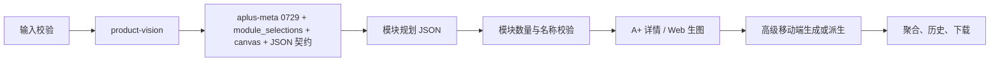

# Listingo 业务逻辑规格书

本文档是开发与验收的业务真实依据。若实现、测试或其他说明冲突，以本文档和当前源码为准。

## 产品范围

Listingo 提供四期统一入口：

- 一期商品套图：支持 Dryrun 和 Live。Live 链路包含商品视觉事实、核心 Meta Prompt 规划、JSON 契约、语义校验、内容安全、并发生图、二次编辑、失败重试、版本、ZIP/长图下载。
- 二期 A+ 详情页：支持 Dryrun 和 Live。使用 `aplus-meta` 0729 资产规划模块，按 `module_selections` 和 `output_targets` 生成详情页、普通 A+、高级 A+ Web、600:450 移动端图。
- 三期视频与爆款复刻：支持 Dryrun 和 Live。Live 保留 `shengsuanyun-doubao-seedance-2-0` Provider code，实际使用斑点蛙 `seedance-2.0` 模型和 `hellobabygo_video_generation` 适配器。
- 四期 Agent 与画布：当前为交互演示，不具备生产 Agent 执行链路。

全局默认 Dryrun。Live 模式必须由本机后台配置 Provider、API Key、Prompt 和必要运行时设置。

## 输入规则

- 商品图上传支持 JPG、PNG、WebP，单文件最大 15MB。
- 套图任务上传 1-3 张商品图；智能匹配固定生成 7 张，自定义结构生成 7-12 张。
- 套图自定义结构包含白底图、场景图、卖点图、其他图四类，每类 0-4 张，总数必须与 `count` 一致。
- A+ 计划任务上传 1-3 张商品图；`module_selections` 是 `{name, count}` 数组，总模块数由 `module_total` 计算，当前最大值由 `A_PLUS_MODULE_TOTAL_LIMIT` 控制。
- A+ `output_targets` 决定输出模式与比例。非亚马逊平台不得创建普通 A+ 或高级 A+ 输出。
- 视频任务上传 1-3 张商品图，支持 1-3 个 `video_types`，默认 15 秒、720p、生成音频。
- 用户未提供或图片不可见的商品事实必须标注不确定，不得编造价格、销量、认证、规格、功效或竞品结论。

## 当前运行提示词

源码 seed 使用 7 类 Prompt 资产：

| Code | 运行节点 |
|---|---|
| `ecommerce-meta` | 套图核心规划 |
| `aplus-meta` | A+ 详情页模块规划 |
| `product-vision` | 商品视觉事实 |
| `copywriting-assist` | 套图/视频卖点帮写 |
| `edit-rewrite` | 二次编辑指令转写 |
| `content-safety-review` | 内容安全 LLM 审查 |
| `ecommerce-video-meta-15s` | 视频分镜规划 |

`image-quality-review` 是历史 Prompt 记录，可能保留在本地 SQLite 中，但当前 Workflow 和执行器不再调用。

## 套图执行链路

- JSON 顶层必须为 `{schema_version:"1.0", images:[...]}`，每张图必须包含 `route_symbol`、`image_type`、`picture_requirement`、`copywriting_requirements`。
- 一期只接受 `route_symbol="#@"`。
- `picture_requirement` 必须显式包含本次 `aspect_ratio`；若仅缺比例，执行器会先自动补齐再做语义判断。
- 语义校验覆盖商品锁定、无文字策略、Amazon 白底首图、自定义数量、重复职责等高风险规则。
- 商品保持优先走 `suite_fidelity` route：Nano Banana Pro primary，Nano Banana 2 fallback。
- 视觉排版优先走 `suite_layout` route：Image 2 primary。
- 成功项立即落盘；部分失败时任务为 `partial_failed`，重试只重跑失败项。

## A+ 执行链路

- `aplus-meta` 使用 `backend/app/prompts/aplus_meta_prompt_0729.md`。
- 运行时变量包括 `product_info`、`platform`、`market`、`language`、`input_language`、`modules`、`brand_style`、`reference_assets`、`module_selections`、`canvas`、`output_targets`、`width`、`height`、`proportion`。
- 最终规划输出必须包含 `global_plan` 和 `modules` 数组；数组长度和顺序必须严格匹配 `module_selections` 展开的模块清单。
- 每个模块必须保留 `#@ 模块名称:核心主题` 形式的实际生图子 Prompt。
- A+ Web/详情走 `aplus_detail` route；高级移动端走 `aplus_mobile` route。
- `GET /aplus-generation-jobs` 只返回非后台测试任务。

## 视频执行链路

- 视频 Provider code 保持 `shengsuanyun-doubao-seedance-2-0`，模型改为斑点蛙 `seedance-2.0`。
- payload 使用斑点蛙任务式接口：`model`、`prompt`、`seconds`、`size`、`resolution`、`images`。
- 默认分辨率为 720p，可选 720p、1080p。
- 按 Provider `poll_interval_seconds` 配置轮询；超时或 Provider 返回失败时单项失败并可重试。
- Live 视频要求 `LISTINGO_PUBLIC_ASSET_BASE_URL` 是外部可访问地址，不能是 `localhost` 或 `127.0.0.1`。
- `GET /video-jobs` 只返回非后台测试任务。

## 内容安全

- 本地关键词过滤覆盖生成任务输入、AI 帮写输入/输出、视频帮写输入/输出、视频任务输入。
- LLM 审查使用 `content-safety-review`，输出 `ContentSafetyReview` JSON：`schema_version`、`passed`、`categories`、`issues`。
- 套图会审查规划文本和每张成图；视频会审查输入和分镜脚本。
- 未通过时抛出 `ContentSafetyBlocked`，接口返回 4xx 或任务进入失败状态。
- Dryrun 会执行本地关键词过滤，但不会外调 LLM 安全审查。

## Provider 规则

- Live 选择 Provider 时优先使用 route role，而不是只看全局默认/备用。
- `llm` route 需要 primary 和 fallback 均可用。
- `suite_fidelity` route 允许 primary → fallback。
- `suite_layout`、`aplus_detail`、`aplus_mobile`、`video` 当前只要求 primary。
- Provider 只有同时启用并配置 API Key 才可用于 Live。
- 请求/响应日志必须脱敏，不记录 API Key、Authorization、Cookie 或完整 base64。

## Workflow 与版本

- 套图 Workflow 为 8 节点、7 边：`input → product_vision → meta_prompt → llm → contract → semantic_validator → image_generate → aggregate`。
- 视频 Workflow：`input → product_vision → video_meta_prompt → llm → contract → video_generate → aggregate`。
- A+ Workflow：`input → product_vision → aplus_meta_prompt → llm → module_router → image_generate / image_edit → aggregate`。
- Workflow 画布用于版本、校验和任务引用；运行时执行顺序由后端固定执行器实现。
- 已创建任务始终引用其创建时锁定的 Prompt 与 Workflow 版本，不随后台启用版本变化。

## API

公共接口位于 `/api/v1`，运营接口位于 `/api/v1/admin`。完整请求/响应模型以 FastAPI OpenAPI 为准。

- 套图：`POST /assets`、`POST /generation-jobs`、`GET /generation-jobs`、`GET /generation-jobs/{id}`、`POST /generation-jobs/{id}/retry-failed`、`GET /generation-jobs/{id}/download`、`POST /generation-items/{id}/versions`、`POST /copywriting-assist`。
- A+：`POST /aplus-plan-jobs`、`GET /aplus-plan-jobs/{id}`、`POST /aplus-generation-jobs`、`GET /aplus-generation-jobs`、`GET /aplus-generation-jobs/{id}`、`POST /aplus-generation-jobs/{id}/retry-failed`、`GET /aplus-generation-jobs/{id}/download`。
- 视频：`POST /video-jobs`、`GET /video-jobs`、`GET /video-jobs/{id}`、`POST /video-jobs/{id}/retry-failed`、`GET /video-jobs/{id}/download`、`POST /video-copywriting-assist`。
- 后台：`/providers`、`/providers/{id}/test`、`/prompts`、`/prompts/{id}/versions`、`/prompts/{id}/versions/upload`、`/prompts/{id}/compare`、`/prompts/{id}/versions/{vid}/activate`、`/prompts/{id}/test-runs`、`/prompt-test-runs/{run_id}`、`/workflows`、`/workflows/{wid}/versions`、`/workflows/{wid}/versions/{vid}/activate`、`/workflows/.../dryrun`、`/logs`、`/runtime-settings`。

## 状态与异常

| 场景 | 行为 |
|---|---|
| 上传非法 | 422，不创建资产记录 |
| Live Provider 不可用 | 409，返回缺失的 route 或模型能力 |
| Prompt/Workflow 未启用 | 409 或 500，视调用阶段返回 |
| Prompt JSON 非法 | 一次修复，仍失败则任务失败 |
| 语义校验失败 | 一次重规划，仍失败则任务失败 |
| 内容安全未通过 | 抛出 `ContentSafetyBlocked` |
| 部分图片/模块/视频失败 | 保留成功项，任务 `partial_failed` |
| 全部失败 | 任务 `failed` |
| 后台完整链路测试 | 创建 `is_admin_test=true` 任务，不出现在前台历史 |

## 非目标

不实现用户登录、管理员登录、支付、公网生产鉴权、Redis、Celery、对象存储或生产数据库。`/admin` 仅用于绑定 `127.0.0.1` 的本机演示。
