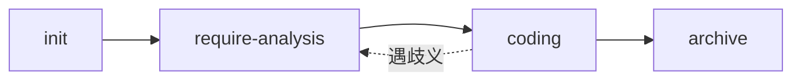

# AGENTS — AI Agent 协作规范

> 本项目 AI 协作约定，配合根目录 `.coderules` 使用。
> 注：本项目以 `spec.md`（即 `SPEC.md`，Windows 大小写不敏感视为同一文件）与 `TECH_STACK.md` 为权威摘要；`README.md` 已删除，权威事实源为 `spec.md`、`TASKS.md`、`TECH_STACK.md`、`开发计划.md`、当前源码，以及 `docs/CONTEXT_SUMMARY.md` 语义索引。

## 工作流

`init → require-analysis → coding → archive`
（`coding` 遇未定义需求时回退至 `require-analysis` 补充）

## 各 Skill 职责边界

- **init**：本项目 `spec.md` 已存在（沿用既有文档，未重新生成），`init` 建立 `docs/` 全套骨架（CONTEXT_SUMMARY / ARCHITECTURE / API_REFERENCE / DB_SCHEMA / BUSINESS_DOMAIN / AGENTS / CHANGELOG）。
- **require-analysis**：每次变更起点，产出 `change.md`（含 Open Questions）+ `checklists.md`，创建 `changes/NNN-slug/`。
- **coding**：强制回填 `checklists.md` 检查点；遇歧义中断，写入 Open Questions 等待人工响应。
- **archive**：归档变更并增量更新 `CONTEXT_SUMMARY.md`，不碰其他文档。
- **doc-update**（按需、非常驻）：把特定变更同步进内容型文档（ARCHITECTURE/API_REFERENCE/DB_SCHEMA/BUSINESS_DOMAIN）并维护 CONTEXT_SUMMARY 索引保鲜。

## 关键约定

- 需求歧义：写入 `change.md` 的 Open Questions，人工介入前 AI 不猜测。
- 文档保鲜：模块变更后由 `archive` 增量更新 `docs/CONTEXT_SUMMARY.md`；内容型文档深度更新由 `doc-update` 负责。
- 提交安全：源码安全同步推 `origin/main`；不提交运行时数据（含 SQLite 审计备份）、密钥、`.env`、上传/结果/日志/缓存/临时测试 DB。
- 测试：后端 `.venv/Scripts/python.exe -m pytest backend/tests`；前端 `cd frontend && npm run test:run`。
- 本地事实以源码为准：Provider 预设（47）、Prompt 资产（8 类）、route roles 见 `backend/app/services/{provider_catalog,provider_routing}.py` 与 `seed.py`。
