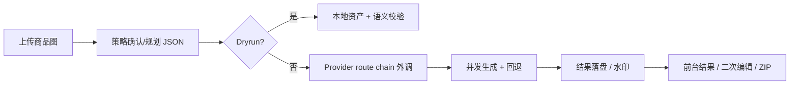

# ARCHITECTURE — 架构设计

> 本文件为架构骨架，细节由后续 `doc-update` 增量填充。模块职责与路径以 `docs/CONTEXT_SUMMARY.md` 为准。
> 业务事实以 `TASKS.md`、`TECH_STACK.md`、`开发计划.md` 与当前源码为准（原 `SPEC.md`/`README.md` 已删除）。

## 总体架构

本机 / 私有化运行的**模块化单体**应用，前后端独立开发、同仓交付：

```
┌─────────────────────────┐         ┌──────────────────────────────┐
│  Frontend (Vue 3 SPA)   │  HTTP   │  Backend (FastAPI + SQLite)  │
│  /app 工作台  /admin 后台│ ──────▶ │  auth / public / admin 路由   │
│  Ant Design Vue + Pinia │ ◀────── │  services/* 任务与 Provider   │
│  ECharts + Vue Flow     │         │  SQLAlchemy + Alembic         │
└─────────────────────────┘         └──────────────┬───────────────┘
                                                    │
                                          ┌─────────▼─────────┐
                                          │ SQLite (唯一持久化)│
                                          │ data/listingo.db  │
                                          └───────────────────┘
```

- 前端单页应用，四期入口统一于 `/app` 工作台；`/admin` 为运营后台。
- 后端为同步 SQLAlchemy 会话 + 进程内异步任务执行，**单进程**调度，无 Redis / Celery / 对象存储。
- 所有外部模型经 Provider 适配器隔离；Prompt / Workflow / Provider 均版本化，历史任务固定引用创建时版本。

## 目录结构

```
Listingo/
├── backend/app/
│   ├── main.py            # FastAPI 装配、lifespan、挂载 3 路由
│   ├── config.py          # 环境变量 / 运行时配置
│   ├── database.py        # 引擎 / 会话 / Base
│   ├── models.py          # 全部 ORM 表（30+）
│   ├── schemas.py         # Pydantic 契约
│   ├── security.py        # 密码哈希 / JWT / API Key 加密
│   ├── seed.py            # Provider / Prompt / Workflow seed
│   ├── api/               # auth.py / public.py / admin.py
│   ├── services/          # 23 个服务（见 CONTEXT_SUMMARY §2）
│   ├── providers/         # 47 个源码 Provider 预设
│   └── prompts/           # 8 类 Prompt 资产
├── frontend/src/
│   ├── main.ts / router/index.ts / api/client.ts
│   └── features/{workspace,auth,admin}/
├── data/                  # sqlite3 / uploads / results / exports / .secret_key（均不提交）
├── docs/                  # 本文档集
├── changes/               # 变更目录（仅 _TEMPLATE，无 archive/）
└── .coderules             # 编码与 AI 协作规范
```

## 关键决策

- **单一持久化源 = SQLite**：运行时 DB、密钥、上传、结果、导出、构建产物均不提交 Git。
- **进程内调度**：`BatchScheduler` 在应用 lifespan 启动（测试模式由显式 tick 驱动）；`ProviderConcurrencyLimiter` 进程级，普通/A+/子编辑/OCR/批量任务共享。
- **默认全局 Dryrun**：未配置有效 Provider 与密钥不得外调；`LISTINGO_GLOBAL_DRY_RUN` 控制。
- **版本化资产**：Prompt（8 类）、Workflow、Provider route chain 全部版本化；后台启用新版本不影响历史任务。
- **本地密钥加密**：API Key 经 Cryptography(Fernet) 本机加密，`.secret_key` 不提交。
- **不引入**：Redis、Celery、对象存储、真实支付网关、SSO、生产数据库。

## 图例（任务生命周期）



> 完整 API 路径见 `docs/API_REFERENCE.md`；表结构见 `docs/DB_SCHEMA.md`；业务域见 `docs/BUSINESS_DOMAIN.md`。
